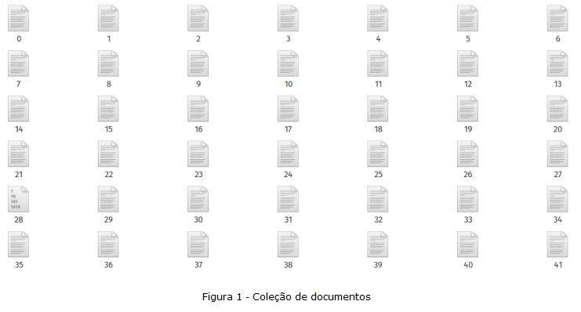
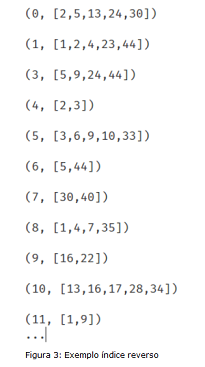

# **Reverse Index**

## **Context**
We want to further increase our availability of books, but lately we have noticed that many of our contributors report the enormous difficulty of finding a document on a particular subject, given the huge collection we make available.

## **Approach**
The challenge is to build a reverse index that speeds up calculations. Often the calculations are based on a scalar product that end up consuming a lot of memory and CPU on the computer, having a reverse index simplifies the calculations.
**You need to write an efficient implementation of a reverse index that indexes a large number of documents.**

## **Goals**
1. **Implement a Job to build the dictionary**. Each line of the output file must be the word followed by its identifier (**world_id**). In documents stored in the *dataset* directory, words are separated by one or more spaces.
2. Implement one or more *Jobs* to build the reverse index

## **Algorithm**
### Documents
There are **n** documents (books). In our case, we have 1 file per document and the filename is simply the index number of the document, as shown in figure 1.
<br/>
<br/>



### Dictionary
We want a dictionary that performs a **“match”** of each word contained in the documents with a unique identifier **“word_id”**, as shown in Figure 2.
<br/>
<br/>


### Reverse Index
Using both the dataset and dictionary, we could build a reverse index which gives, for each word, the list of documents in which the word is contained, see figure 3.
<br/>
<br/>


These are the 4 steps of the algorithm:
1. Read the documents and retrieve each pair (**wordId**, **documentId**)
2. Sort each pair by **worldId** and **documentId**
3. For each **worldId**, group the pairs to have the list of documents containing the word
4. Merge the intermediate results to have the final reverse index
<br/>
<br/>


---

<br/>

# **Implementation**
## **Requirements**
This project is tested with:

| Requisite | Version   |
|-----------|-----------|
| Python    | 3.8.10    |
| Pip       | 21.2.4    |
| Java      | 1.8.0_282 |
| Spark     | 3.2.0     |

I recommend using Python [venv](https://github.com/brunocampos01/becoming-a-expert-python) and [SdkMan](https://sdkman.io/).

#### Install Libraries
```
pip install --require-hashes -r requirements.txt
```

## **Running**
In terminal running command
```bash
# generated dictionary at /tmp/dict
spark-submit jobs/job_generate_dict.py

# generated index
spark-submit jobs/job_map_wordid_documentid.py
```

See execution progress at `tmp/log_reverse_index.log`. Example:
```bash
06-Jan-22 20:42:16 - WARNING: Processing doc: dataset/4
06-Jan-22 20:42:50 - WARNING: total words = 117240
06-Jan-22 20:43:15 - WARNING: Total time: 0:01:16.951967
06-Jan-22 20:43:17 - WARNING: Processing doc: dataset/35
06-Jan-22 20:43:39 - WARNING: total words = 234480
...
```

**NOTE**: this solution is limited by size memory.

---

<p  align="left">
<br/>
<a href="mailto:brunocampos01@gmail.com" target="_blank">
</a>
<a href="https://stackoverflow.com/users/8329698/bruno-campos" target="_blank">
</a>
<a href="https://www.linkedin.com/in/brunocampos01" target="_blank"></a>
<a href="https://github.com/brunocampos01" target="_blank"></a>
<a href="https://medium.com/@brunocampos01" target="_blank">
</a>
<a rel="license" href="http://creativecommons.org/licenses/by-sa/4.0/"></a><br/>
</p>
